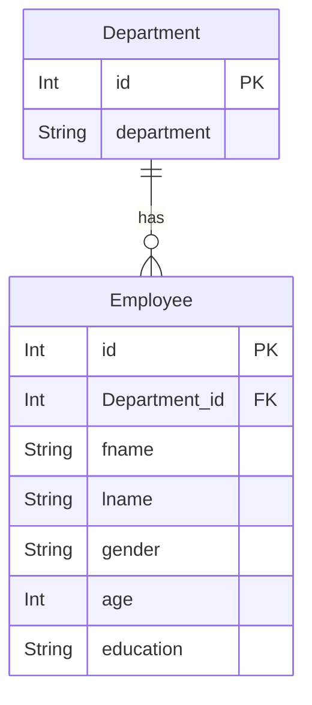

# Employee

## Database

## Functions

1. การแสดงรายชื่อพนักงาน
2. จัดหมวดหมู่พนักงานด้วยแผนก
3. เรียกดูผนักงานแต่ละแผนก
4. เพิ่มแผนกได้ (นอกเหนือจากโจทย์)
5. เพิ่มข้อมูลพนักงานจากหน้า admin

## Information

* Front end
  * [sneat template (Bootstrap5 template)](https://themeselection.com/item/sneat-bootstrap-html-admin-template/)
  * VueJs 3
  * Bootstrap 5
  * HTML 5
  * CSS 3
* API
  * Django Rest Framework
  * Axios
* Back end
  * Django
* Database
  * postgresQL Vercel
* Deployment
  * Vervel
